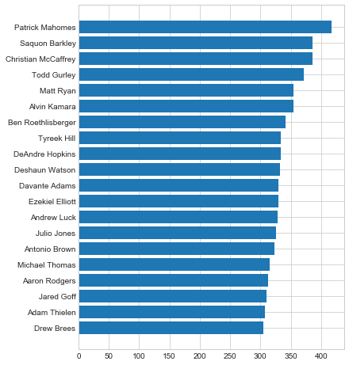
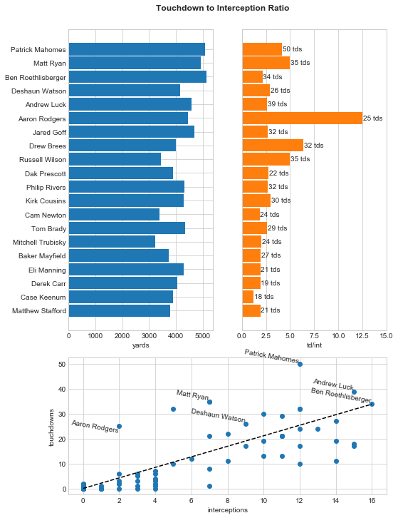
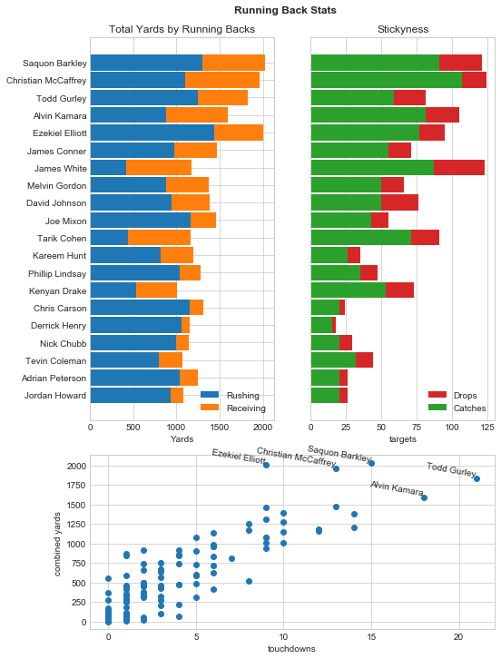
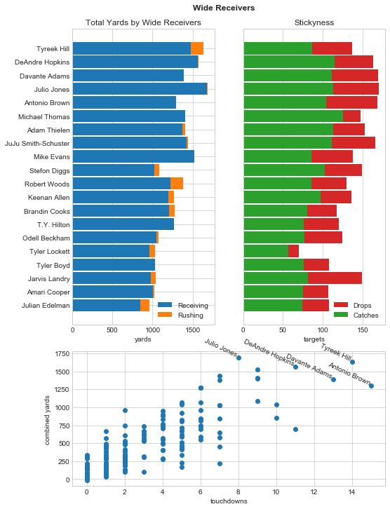
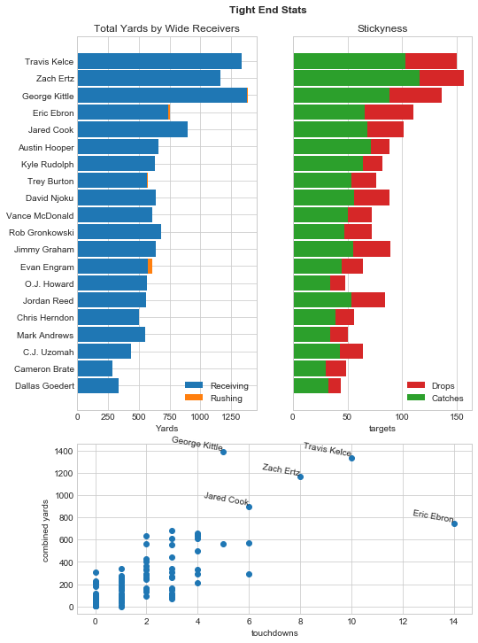
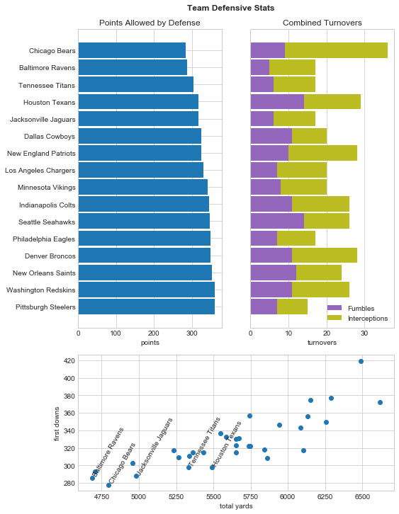

```python
import matplotlib.pyplot as plt
from matplotlib.gridspec import GridSpec
import numpy as np
import pandas as pd
from IPython.display import HTML

from src.general_parser import scrape_table, parse_data_table

%matplotlib inline
pd.set_option('display.max_columns', None)
plt.style.use('seaborn-whitegrid')
```


```python
fantasy = 'https://www.pro-football-reference.com/years/2018/fantasy.htm'
team_defense = 'https://www.pro-football-reference.com/years/2018/opp.htm'
```


```python
fantasy_players = parse_data_table(scrape_table(fantasy))
defenses = parse_data_table(scrape_table(team_defense))
```


```python
numerics = [
    'age', 'g', 'gs', 'pass_cmp', 'pass_att', 'pass_int',
    'pass_yds', 'pass_td', 'rush_att', 'rush_yds', 'rush_yds_per_att', 'rush_td',
    'targets', 'rec', 'rec_yds', 'rec_yds_per_rec',
    'rec_td', 'fumbles', 'fumbles_lost', 'all_td', 
    'two_pt_md', 'two_pt_pass', 'fantasy_points',
    'fantasy_points', 'fantasy_points_ppr',
    'draftkings_points', 'fanduel_points', 'vbd',
    'fantasy_rank_pos', 'fantasy_rank_overall'
]
```


```python
for field in numerics:
    fantasy_players[field] = pd.to_numeric(fantasy_players[field])
```

# DeNumbers with Denoux

AAAAAAAAAAAAAAAAAAAAAAAAAAAAAAAAAAAAANd we back baby! Ready for another exciting (read hair-pulling) year of fantasy football where only the most skill (read luckiest) of the bunch will come out on top and claim victory over the rest.

This year I plan on having more comprehensive reports for each and every week so that we don't just dog on Andy Dalton when he inevitably lets us all down by being completely mediocre. My money is on Carson Wentz to become the next Andy Dalton. Alternatively, La'veon Bell is back in action and ready to put up huge fantsay numbers after all but nuking Bradley's chances of ever being competetive last year.

Let's get started by looking at which players put up the most fantasy points overall during the 2018 season.


```python
player_stats = ['player', 'team', 'fumbles', 'fumbles_lost', 'all_td']

fantasy_players.sort_values(by='fantasy_points_ppr', ascending=False, inplace=True)

# Create a couple of calculated fields across all subsets of data
fantasy_players['td/int'] = fantasy_players['pass_td'] / fantasy_players['pass_int']
fantasy_players['catch_pct'] = fantasy_players['rec'] / fantasy_players['targets']
fantasy_players['yds/td'] = (fantasy_players['rush_yds'] + fantasy_players['rec_yds']) / fantasy_players['all_td']

top_players = fantasy_players[:20].sort_values(by='fantasy_points_ppr')

plt.figure(figsize=(6, 8))
plt.barh(top_players['player'], top_players['fantasy_points_ppr'])
```


    <BarContainer object of 20 artists>





No surprise that the league MVP brought home the most fantasy points using Kansas City's explosive offensive punch (even if it did come at the cost of Drew Bree's best shot at MVP). Saquon Barkley and Christian McCaffrey managed to scoop up the next two spots even though their teams suck hot ass. This just goes to show that even piles of shit can have a gleaming golden piece of corn glimmer through. Wait...

### HOW DID FUCKBOI JARED GOFF GET MORE POINTS THAN DREW BREES!!!!

Sometimes the universe is just cruel, and then Rodger Goodell has to come and piss on your shoes and call it rain right to your face.

Let's break it down by major PPR position
* [Quarterbacks](#qb)
* [Running Backs](#rb)
* [Wide Receivers](#wr)
* [Tight Ends (heh)](#te)
* [Defenses](#def)

<a id='qb'></a>
### Quarterbacks

The gunslingers have the job of passing teh rock around to all of your star receivers (or their safeties if you picked Andy Daltman). In PPR, quarterbacks live and die by the Touchdown to Interception (TD/INT) ratio. It doesn't do you any good if your Andrew Luck throws up 4 touchdowns only to drag you back down with 3 picks. Good thing he gets to pick his nose now that the old boomer has retired. 

Here's a look at the top 10 quarterbacks in 2018 according to ppr scoring


```python
qb_stats = ['pass_cmp', 'pass_att', 'pass_yds', 'pass_td', 'pass_int']

quarterbacks = fantasy_players.loc[fantasy_players['fantasy_pos'] == 'QB', :]

top_qbs = quarterbacks.head(20).sort_values(by='fantasy_points_ppr')
quarterbacks[player_stats + qb_stats + ['td/int']].head(20)
```


<div>
<style scoped>
    .dataframe tbody tr th:only-of-type {
        vertical-align: middle;
    }

    .dataframe tbody tr th {
        vertical-align: top;
    }

    .dataframe thead th {
        text-align: right;
    }
</style>
<table border="1" class="dataframe">
  <thead>
    <tr style="text-align: right;">
      <th></th>
      <th>player</th>
      <th>team</th>
      <th>fumbles</th>
      <th>fumbles_lost</th>
      <th>all_td</th>
      <th>pass_cmp</th>
      <th>pass_att</th>
      <th>pass_yds</th>
      <th>pass_td</th>
      <th>pass_int</th>
      <th>td/int</th>
    </tr>
  </thead>
  <tbody>
    <tr>
      <th>4</th>
      <td>Patrick Mahomes</td>
      <td>KAN</td>
      <td>9</td>
      <td>2</td>
      <td>2</td>
      <td>383</td>
      <td>580</td>
      <td>5097</td>
      <td>50</td>
      <td>12</td>
      <td>4.166667</td>
    </tr>
    <tr>
      <th>20</th>
      <td>Matt Ryan</td>
      <td>ATL</td>
      <td>10</td>
      <td>5</td>
      <td>4</td>
      <td>422</td>
      <td>608</td>
      <td>4924</td>
      <td>35</td>
      <td>7</td>
      <td>5.000000</td>
    </tr>
    <tr>
      <th>26</th>
      <td>Ben Roethlisberger</td>
      <td>PIT</td>
      <td>7</td>
      <td>2</td>
      <td>3</td>
      <td>452</td>
      <td>675</td>
      <td>5129</td>
      <td>34</td>
      <td>16</td>
      <td>2.125000</td>
    </tr>
    <tr>
      <th>30</th>
      <td>Deshaun Watson</td>
      <td>HOU</td>
      <td>9</td>
      <td>3</td>
      <td>5</td>
      <td>345</td>
      <td>505</td>
      <td>4165</td>
      <td>26</td>
      <td>9</td>
      <td>2.888889</td>
    </tr>
    <tr>
      <th>37</th>
      <td>Andrew Luck</td>
      <td>IND</td>
      <td>6</td>
      <td>1</td>
      <td>0</td>
      <td>430</td>
      <td>639</td>
      <td>4593</td>
      <td>39</td>
      <td>15</td>
      <td>2.600000</td>
    </tr>
    <tr>
      <th>42</th>
      <td>Aaron Rodgers</td>
      <td>GNB</td>
      <td>6</td>
      <td>3</td>
      <td>2</td>
      <td>372</td>
      <td>597</td>
      <td>4442</td>
      <td>25</td>
      <td>2</td>
      <td>12.500000</td>
    </tr>
    <tr>
      <th>44</th>
      <td>Jared Goff</td>
      <td>LAR</td>
      <td>12</td>
      <td>5</td>
      <td>3</td>
      <td>364</td>
      <td>561</td>
      <td>4688</td>
      <td>32</td>
      <td>12</td>
      <td>2.666667</td>
    </tr>
    <tr>
      <th>51</th>
      <td>Drew Brees</td>
      <td>NOR</td>
      <td>5</td>
      <td>1</td>
      <td>4</td>
      <td>364</td>
      <td>489</td>
      <td>3992</td>
      <td>32</td>
      <td>5</td>
      <td>6.400000</td>
    </tr>
    <tr>
      <th>57</th>
      <td>Russell Wilson</td>
      <td>SEA</td>
      <td>10</td>
      <td>2</td>
      <td>0</td>
      <td>280</td>
      <td>427</td>
      <td>3448</td>
      <td>35</td>
      <td>7</td>
      <td>5.000000</td>
    </tr>
    <tr>
      <th>68</th>
      <td>Dak Prescott</td>
      <td>DAL</td>
      <td>12</td>
      <td>6</td>
      <td>6</td>
      <td>356</td>
      <td>526</td>
      <td>3885</td>
      <td>22</td>
      <td>8</td>
      <td>2.750000</td>
    </tr>
    <tr>
      <th>69</th>
      <td>Philip Rivers</td>
      <td>LAC</td>
      <td>2</td>
      <td>1</td>
      <td>0</td>
      <td>347</td>
      <td>508</td>
      <td>4308</td>
      <td>32</td>
      <td>12</td>
      <td>2.666667</td>
    </tr>
    <tr>
      <th>79</th>
      <td>Kirk Cousins</td>
      <td>MIN</td>
      <td>9</td>
      <td>7</td>
      <td>1</td>
      <td>425</td>
      <td>606</td>
      <td>4298</td>
      <td>30</td>
      <td>10</td>
      <td>3.000000</td>
    </tr>
    <tr>
      <th>78</th>
      <td>Cam Newton</td>
      <td>CAR</td>
      <td>6</td>
      <td>0</td>
      <td>4</td>
      <td>320</td>
      <td>471</td>
      <td>3395</td>
      <td>24</td>
      <td>13</td>
      <td>1.846154</td>
    </tr>
    <tr>
      <th>80</th>
      <td>Tom Brady</td>
      <td>NWE</td>
      <td>4</td>
      <td>2</td>
      <td>2</td>
      <td>375</td>
      <td>570</td>
      <td>4355</td>
      <td>29</td>
      <td>11</td>
      <td>2.636364</td>
    </tr>
    <tr>
      <th>81</th>
      <td>Mitchell Trubisky</td>
      <td>CHI</td>
      <td>6</td>
      <td>3</td>
      <td>3</td>
      <td>289</td>
      <td>434</td>
      <td>3223</td>
      <td>24</td>
      <td>12</td>
      <td>2.000000</td>
    </tr>
    <tr>
      <th>83</th>
      <td>Baker Mayfield</td>
      <td>CLE</td>
      <td>7</td>
      <td>3</td>
      <td>0</td>
      <td>310</td>
      <td>486</td>
      <td>3725</td>
      <td>27</td>
      <td>14</td>
      <td>1.928571</td>
    </tr>
    <tr>
      <th>82</th>
      <td>Eli Manning</td>
      <td>NYG</td>
      <td>7</td>
      <td>4</td>
      <td>1</td>
      <td>380</td>
      <td>576</td>
      <td>4299</td>
      <td>21</td>
      <td>11</td>
      <td>1.909091</td>
    </tr>
    <tr>
      <th>84</th>
      <td>Derek Carr</td>
      <td>OAK</td>
      <td>12</td>
      <td>7</td>
      <td>1</td>
      <td>381</td>
      <td>553</td>
      <td>4049</td>
      <td>19</td>
      <td>10</td>
      <td>1.900000</td>
    </tr>
    <tr>
      <th>85</th>
      <td>Case Keenum</td>
      <td>DEN</td>
      <td>11</td>
      <td>2</td>
      <td>2</td>
      <td>365</td>
      <td>586</td>
      <td>3890</td>
      <td>18</td>
      <td>15</td>
      <td>1.200000</td>
    </tr>
    <tr>
      <th>86</th>
      <td>Matthew Stafford</td>
      <td>DET</td>
      <td>6</td>
      <td>4</td>
      <td>0</td>
      <td>367</td>
      <td>555</td>
      <td>3777</td>
      <td>21</td>
      <td>11</td>
      <td>1.909091</td>
    </tr>
  </tbody>
</table>
</div>


```python
td_int_ratio = quarterbacks.loc[quarterbacks['pass_att'] > 50, ['td/int']].mean()
print('League average td/int')
print(td_int_ratio.values)
```

    League average td/int
    [2.11619725]


And this is a visualization of the td/int figure. The dashed line is the league average TD/INT (~2.12). Remember kids, you miss all the shots you don't take


```python
plt.figure(figsize=(8, 12))
plt.suptitle('Touchdown to Interception Ratio', weight='heavy', y=0.92)

plt.subplot2grid((3, 2), (0, 1), rowspan=2)
plt.barh(top_qbs['player'], width=top_qbs['td/int'], color='C1', height=0.9)
plt.xlabel('td/int')
plt.xlim([0, 15])
plt.yticks([])
for index, row in top_qbs.iterrows():
    plt.annotate(
        '{} tds'.format(row['pass_td']),
        (row['td/int'] + 0.05, row['player']),
        ha='left', va='center' 
    )
    
plt.subplot2grid((3, 2), (0, 0), rowspan=2)
plt.barh(top_qbs['player'], width=top_qbs['pass_yds'], height=0.9)
plt.xlabel('yards')

plt.subplot2grid((3, 2), (2, 0), colspan=2)
plt.scatter(quarterbacks['pass_int'], quarterbacks['pass_td'])
plt.xlabel('interceptions')
plt.ylabel('touchdowns')

x_vals = [0, quarterbacks['pass_int'].max()]
y_vals = [0, quarterbacks['pass_int'].max() * td_int_ratio]
plt.plot(x_vals, y_vals, 'k--')

for index, row in quarterbacks.head().iterrows():
    plt.annotate(
        row['player'],
        (int(row['pass_int']), int(row['pass_td'])),
        ha='right', va='bottom', rotation=350
    )

a_rodgy = quarterbacks[quarterbacks['player'] == 'Aaron Rodgers']
plt.annotate(
    a_rodgy['player'].values[0],
    (int(a_rodgy['pass_int']), int(a_rodgy['pass_td'])),
    ha='right', va='center', rotation=350
)
```


    Text(2, 25, 'Aaron Rodgers')





<a id='rb'></a>
### Running Backs

These guys could either be the most dynamic position on your roster or the biggest let downs you just have to put in the game. It really comes down to how often they get the ball thrown their way.

At this point the skill positions carry aimilar statistics and score the same way in PPR leagues so the visualizations will basically be the same from this point on.


```python
rb_stats = [
    'rush_att', 'rush_yds', 'rush_yds_per_att', 'rush_td',
    'targets', 'rec', 'catch_pct', 'rec_yds', 'rec_td', 'yds/td'
]

running_backs = fantasy_players[fantasy_players['fantasy_pos'] == 'RB']
top_backs = running_backs.head(20).sort_values(by='fantasy_points_ppr')

running_backs[player_stats + rb_stats].head(20)
```


<div>
<style scoped>
    .dataframe tbody tr th:only-of-type {
        vertical-align: middle;
    }

    .dataframe tbody tr th {
        vertical-align: top;
    }

    .dataframe thead th {
        text-align: right;
    }
</style>
<table border="1" class="dataframe">
  <thead>
    <tr style="text-align: right;">
      <th></th>
      <th>player</th>
      <th>team</th>
      <th>fumbles</th>
      <th>fumbles_lost</th>
      <th>all_td</th>
      <th>rush_att</th>
      <th>rush_yds</th>
      <th>rush_yds_per_att</th>
      <th>rush_td</th>
      <th>targets</th>
      <th>rec</th>
      <th>catch_pct</th>
      <th>rec_yds</th>
      <th>rec_td</th>
      <th>yds/td</th>
    </tr>
  </thead>
  <tbody>
    <tr>
      <th>1</th>
      <td>Saquon Barkley</td>
      <td>NYG</td>
      <td>0</td>
      <td>0</td>
      <td>15</td>
      <td>261</td>
      <td>1307</td>
      <td>5.01</td>
      <td>11</td>
      <td>121</td>
      <td>91</td>
      <td>0.752066</td>
      <td>721</td>
      <td>4</td>
      <td>135.200000</td>
    </tr>
    <tr>
      <th>2</th>
      <td>Christian McCaffrey</td>
      <td>CAR</td>
      <td>4</td>
      <td>1</td>
      <td>13</td>
      <td>219</td>
      <td>1098</td>
      <td>5.01</td>
      <td>7</td>
      <td>124</td>
      <td>107</td>
      <td>0.862903</td>
      <td>867</td>
      <td>6</td>
      <td>151.153846</td>
    </tr>
    <tr>
      <th>0</th>
      <td>Todd Gurley</td>
      <td>LAR</td>
      <td>1</td>
      <td>1</td>
      <td>21</td>
      <td>256</td>
      <td>1251</td>
      <td>4.89</td>
      <td>17</td>
      <td>81</td>
      <td>59</td>
      <td>0.728395</td>
      <td>580</td>
      <td>4</td>
      <td>87.190476</td>
    </tr>
    <tr>
      <th>3</th>
      <td>Alvin Kamara</td>
      <td>NOR</td>
      <td>1</td>
      <td>0</td>
      <td>18</td>
      <td>194</td>
      <td>883</td>
      <td>4.55</td>
      <td>14</td>
      <td>105</td>
      <td>81</td>
      <td>0.771429</td>
      <td>709</td>
      <td>4</td>
      <td>88.444444</td>
    </tr>
    <tr>
      <th>6</th>
      <td>Ezekiel Elliott</td>
      <td>DAL</td>
      <td>6</td>
      <td>1</td>
      <td>9</td>
      <td>304</td>
      <td>1434</td>
      <td>4.72</td>
      <td>6</td>
      <td>95</td>
      <td>77</td>
      <td>0.810526</td>
      <td>567</td>
      <td>3</td>
      <td>222.333333</td>
    </tr>
    <tr>
      <th>13</th>
      <td>James Conner</td>
      <td>PIT</td>
      <td>4</td>
      <td>2</td>
      <td>13</td>
      <td>215</td>
      <td>973</td>
      <td>4.53</td>
      <td>12</td>
      <td>71</td>
      <td>55</td>
      <td>0.774648</td>
      <td>497</td>
      <td>1</td>
      <td>113.076923</td>
    </tr>
    <tr>
      <th>27</th>
      <td>James White</td>
      <td>NWE</td>
      <td>0</td>
      <td>0</td>
      <td>12</td>
      <td>94</td>
      <td>425</td>
      <td>4.52</td>
      <td>5</td>
      <td>123</td>
      <td>87</td>
      <td>0.707317</td>
      <td>751</td>
      <td>7</td>
      <td>98.000000</td>
    </tr>
    <tr>
      <th>12</th>
      <td>Melvin Gordon</td>
      <td>LAC</td>
      <td>1</td>
      <td>0</td>
      <td>14</td>
      <td>175</td>
      <td>885</td>
      <td>5.06</td>
      <td>10</td>
      <td>66</td>
      <td>50</td>
      <td>0.757576</td>
      <td>490</td>
      <td>4</td>
      <td>98.214286</td>
    </tr>
    <tr>
      <th>25</th>
      <td>David Johnson</td>
      <td>ARI</td>
      <td>3</td>
      <td>2</td>
      <td>10</td>
      <td>258</td>
      <td>940</td>
      <td>3.64</td>
      <td>7</td>
      <td>76</td>
      <td>50</td>
      <td>0.657895</td>
      <td>446</td>
      <td>3</td>
      <td>138.600000</td>
    </tr>
    <tr>
      <th>23</th>
      <td>Joe Mixon</td>
      <td>CIN</td>
      <td>0</td>
      <td>0</td>
      <td>9</td>
      <td>237</td>
      <td>1168</td>
      <td>4.93</td>
      <td>8</td>
      <td>55</td>
      <td>43</td>
      <td>0.781818</td>
      <td>296</td>
      <td>1</td>
      <td>162.666667</td>
    </tr>
    <tr>
      <th>45</th>
      <td>Tarik Cohen</td>
      <td>CHI</td>
      <td>7</td>
      <td>3</td>
      <td>8</td>
      <td>99</td>
      <td>444</td>
      <td>4.48</td>
      <td>3</td>
      <td>91</td>
      <td>71</td>
      <td>0.780220</td>
      <td>725</td>
      <td>5</td>
      <td>146.125000</td>
    </tr>
    <tr>
      <th>22</th>
      <td>Kareem Hunt</td>
      <td>KAN</td>
      <td>0</td>
      <td>0</td>
      <td>14</td>
      <td>181</td>
      <td>824</td>
      <td>4.55</td>
      <td>7</td>
      <td>35</td>
      <td>26</td>
      <td>0.742857</td>
      <td>378</td>
      <td>7</td>
      <td>85.857143</td>
    </tr>
    <tr>
      <th>28</th>
      <td>Phillip Lindsay</td>
      <td>DEN</td>
      <td>0</td>
      <td>0</td>
      <td>10</td>
      <td>192</td>
      <td>1037</td>
      <td>5.40</td>
      <td>9</td>
      <td>47</td>
      <td>35</td>
      <td>0.744681</td>
      <td>241</td>
      <td>1</td>
      <td>127.800000</td>
    </tr>
    <tr>
      <th>55</th>
      <td>Kenyan Drake</td>
      <td>MIA</td>
      <td>2</td>
      <td>1</td>
      <td>9</td>
      <td>120</td>
      <td>535</td>
      <td>4.46</td>
      <td>4</td>
      <td>73</td>
      <td>53</td>
      <td>0.726027</td>
      <td>477</td>
      <td>5</td>
      <td>112.444444</td>
    </tr>
    <tr>
      <th>36</th>
      <td>Chris Carson</td>
      <td>SEA</td>
      <td>3</td>
      <td>2</td>
      <td>9</td>
      <td>247</td>
      <td>1151</td>
      <td>4.66</td>
      <td>9</td>
      <td>24</td>
      <td>20</td>
      <td>0.833333</td>
      <td>163</td>
      <td>0</td>
      <td>146.000000</td>
    </tr>
    <tr>
      <th>29</th>
      <td>Derrick Henry</td>
      <td>TEN</td>
      <td>1</td>
      <td>1</td>
      <td>12</td>
      <td>215</td>
      <td>1059</td>
      <td>4.93</td>
      <td>12</td>
      <td>18</td>
      <td>15</td>
      <td>0.833333</td>
      <td>99</td>
      <td>0</td>
      <td>96.500000</td>
    </tr>
    <tr>
      <th>39</th>
      <td>Nick Chubb</td>
      <td>CLE</td>
      <td>0</td>
      <td>0</td>
      <td>10</td>
      <td>192</td>
      <td>996</td>
      <td>5.19</td>
      <td>8</td>
      <td>29</td>
      <td>20</td>
      <td>0.689655</td>
      <td>149</td>
      <td>2</td>
      <td>114.500000</td>
    </tr>
    <tr>
      <th>47</th>
      <td>Tevin Coleman</td>
      <td>ATL</td>
      <td>2</td>
      <td>0</td>
      <td>9</td>
      <td>167</td>
      <td>800</td>
      <td>4.79</td>
      <td>4</td>
      <td>44</td>
      <td>32</td>
      <td>0.727273</td>
      <td>276</td>
      <td>5</td>
      <td>119.555556</td>
    </tr>
    <tr>
      <th>41</th>
      <td>Adrian Peterson</td>
      <td>WAS</td>
      <td>3</td>
      <td>2</td>
      <td>8</td>
      <td>251</td>
      <td>1042</td>
      <td>4.15</td>
      <td>7</td>
      <td>26</td>
      <td>20</td>
      <td>0.769231</td>
      <td>208</td>
      <td>1</td>
      <td>156.250000</td>
    </tr>
    <tr>
      <th>49</th>
      <td>Jordan Howard</td>
      <td>CHI</td>
      <td>2</td>
      <td>1</td>
      <td>9</td>
      <td>250</td>
      <td>935</td>
      <td>3.74</td>
      <td>9</td>
      <td>26</td>
      <td>20</td>
      <td>0.769231</td>
      <td>145</td>
      <td>0</td>
      <td>120.000000</td>
    </tr>
  </tbody>
</table>
</div>


```python
plt.figure(figsize=(8, 12))
plt.suptitle('Running Back Stats', weight='heavy', y=0.92)

plt.subplot2grid((3, 2), (0, 0), rowspan=2)
plt.barh(top_backs['player'], top_backs['rush_yds'], height=0.9)
plt.barh(top_backs['player'], left=top_backs['rush_yds'], width=top_backs['rec_yds'], height=0.9)
plt.xlabel('Yards')
plt.legend(['Rushing', 'Receiving'])

plt.title('Total Yards by Running Backs')

plt.subplot2grid((3, 2), (0, 1), rowspan=2)
plt.barh(top_backs['player'], top_backs['targets'], color='C3', height=0.9)
plt.barh(top_backs['player'], top_backs['rec'], color='C2', height=0.9)
plt.xlabel('targets')
plt.yticks([])
plt.title('Stickyness')
plt.legend(['Drops', 'Catches'])

plt.subplot2grid((3, 2), (2, 0), colspan=2)
plt.scatter(running_backs['all_td'], running_backs['rush_yds'] + running_backs['rec_yds'])
plt.ylabel('combined yards')
plt.xlabel('touchdowns')

for index, row in running_backs.head().iterrows():
    plt.annotate(
        row['player'],
        (row['all_td'], (row['rush_yds'] + row['rec_yds'])),
        ha='right', va='bottom', rotation=350
    )
```





<a id='wr'></a>
### Wide Receivers

Even though these guys rake in the most points and are the best flexes, they don't have as many interesting stats. Wide Receiver end-arounds just aren't what they used to be.

###### They're nothing like that reach-around your mom gave me last weekend

# AYEOOOO!!!!


```python
wr_stats = ['targets', 'rec', 'catch_pct', 'rec_yds', 'rec_yds_per_rec', 'rec_td', 'yds/td']

wide_receivers = fantasy_players[fantasy_players['fantasy_pos'] == 'WR']
top_receivers = wide_receivers.head(20).sort_values(by='fantasy_points_ppr')

wide_receivers[player_stats + wr_stats].head(20)
```


<div>
<style scoped>
    .dataframe tbody tr th:only-of-type {
        vertical-align: middle;
    }

    .dataframe tbody tr th {
        vertical-align: top;
    }

    .dataframe thead th {
        text-align: right;
    }
</style>
<table border="1" class="dataframe">
  <thead>
    <tr style="text-align: right;">
      <th></th>
      <th>player</th>
      <th>team</th>
      <th>fumbles</th>
      <th>fumbles_lost</th>
      <th>all_td</th>
      <th>targets</th>
      <th>rec</th>
      <th>catch_pct</th>
      <th>rec_yds</th>
      <th>rec_yds_per_rec</th>
      <th>rec_td</th>
      <th>yds/td</th>
    </tr>
  </thead>
  <tbody>
    <tr>
      <th>5</th>
      <td>Tyreek Hill</td>
      <td>KAN</td>
      <td>0</td>
      <td>0</td>
      <td>14</td>
      <td>137</td>
      <td>87</td>
      <td>0.635036</td>
      <td>1479</td>
      <td>17.00</td>
      <td>12</td>
      <td>116.428571</td>
    </tr>
    <tr>
      <th>10</th>
      <td>DeAndre Hopkins</td>
      <td>HOU</td>
      <td>2</td>
      <td>2</td>
      <td>11</td>
      <td>163</td>
      <td>115</td>
      <td>0.705521</td>
      <td>1572</td>
      <td>13.67</td>
      <td>11</td>
      <td>142.272727</td>
    </tr>
    <tr>
      <th>9</th>
      <td>Davante Adams</td>
      <td>GNB</td>
      <td>0</td>
      <td>0</td>
      <td>13</td>
      <td>169</td>
      <td>111</td>
      <td>0.656805</td>
      <td>1386</td>
      <td>12.49</td>
      <td>13</td>
      <td>106.615385</td>
    </tr>
    <tr>
      <th>11</th>
      <td>Julio Jones</td>
      <td>ATL</td>
      <td>2</td>
      <td>2</td>
      <td>8</td>
      <td>170</td>
      <td>113</td>
      <td>0.664706</td>
      <td>1677</td>
      <td>14.84</td>
      <td>8</td>
      <td>211.125000</td>
    </tr>
    <tr>
      <th>8</th>
      <td>Antonio Brown</td>
      <td>PIT</td>
      <td>0</td>
      <td>0</td>
      <td>15</td>
      <td>168</td>
      <td>104</td>
      <td>0.619048</td>
      <td>1297</td>
      <td>12.47</td>
      <td>15</td>
      <td>86.466667</td>
    </tr>
    <tr>
      <th>18</th>
      <td>Michael Thomas</td>
      <td>NOR</td>
      <td>2</td>
      <td>2</td>
      <td>9</td>
      <td>147</td>
      <td>125</td>
      <td>0.850340</td>
      <td>1405</td>
      <td>11.24</td>
      <td>9</td>
      <td>156.111111</td>
    </tr>
    <tr>
      <th>17</th>
      <td>Adam Thielen</td>
      <td>MIN</td>
      <td>1</td>
      <td>1</td>
      <td>9</td>
      <td>153</td>
      <td>113</td>
      <td>0.738562</td>
      <td>1373</td>
      <td>12.15</td>
      <td>9</td>
      <td>155.888889</td>
    </tr>
    <tr>
      <th>21</th>
      <td>JuJu Smith-Schuster</td>
      <td>PIT</td>
      <td>1</td>
      <td>1</td>
      <td>7</td>
      <td>166</td>
      <td>111</td>
      <td>0.668675</td>
      <td>1426</td>
      <td>12.85</td>
      <td>7</td>
      <td>205.571429</td>
    </tr>
    <tr>
      <th>15</th>
      <td>Mike Evans</td>
      <td>TAM</td>
      <td>2</td>
      <td>1</td>
      <td>9</td>
      <td>138</td>
      <td>86</td>
      <td>0.623188</td>
      <td>1524</td>
      <td>17.72</td>
      <td>8</td>
      <td>169.333333</td>
    </tr>
    <tr>
      <th>32</th>
      <td>Stefon Diggs</td>
      <td>MIN</td>
      <td>0</td>
      <td>0</td>
      <td>9</td>
      <td>149</td>
      <td>102</td>
      <td>0.684564</td>
      <td>1021</td>
      <td>10.01</td>
      <td>9</td>
      <td>120.333333</td>
    </tr>
    <tr>
      <th>24</th>
      <td>Robert Woods</td>
      <td>LAR</td>
      <td>0</td>
      <td>0</td>
      <td>7</td>
      <td>130</td>
      <td>86</td>
      <td>0.661538</td>
      <td>1219</td>
      <td>14.17</td>
      <td>6</td>
      <td>196.571429</td>
    </tr>
    <tr>
      <th>34</th>
      <td>Keenan Allen</td>
      <td>LAC</td>
      <td>3</td>
      <td>1</td>
      <td>6</td>
      <td>136</td>
      <td>97</td>
      <td>0.713235</td>
      <td>1196</td>
      <td>12.33</td>
      <td>6</td>
      <td>211.833333</td>
    </tr>
    <tr>
      <th>33</th>
      <td>Brandin Cooks</td>
      <td>LAR</td>
      <td>1</td>
      <td>0</td>
      <td>6</td>
      <td>117</td>
      <td>80</td>
      <td>0.683761</td>
      <td>1204</td>
      <td>15.05</td>
      <td>5</td>
      <td>212.000000</td>
    </tr>
    <tr>
      <th>35</th>
      <td>T.Y. Hilton</td>
      <td>IND</td>
      <td>0</td>
      <td>0</td>
      <td>6</td>
      <td>120</td>
      <td>76</td>
      <td>0.633333</td>
      <td>1270</td>
      <td>16.71</td>
      <td>6</td>
      <td>211.666667</td>
    </tr>
    <tr>
      <th>40</th>
      <td>Odell Beckham</td>
      <td>NYG</td>
      <td>2</td>
      <td>1</td>
      <td>6</td>
      <td>124</td>
      <td>77</td>
      <td>0.620968</td>
      <td>1052</td>
      <td>13.66</td>
      <td>6</td>
      <td>178.500000</td>
    </tr>
    <tr>
      <th>31</th>
      <td>Tyler Lockett</td>
      <td>SEA</td>
      <td>2</td>
      <td>0</td>
      <td>10</td>
      <td>70</td>
      <td>57</td>
      <td>0.814286</td>
      <td>965</td>
      <td>16.93</td>
      <td>10</td>
      <td>103.400000</td>
    </tr>
    <tr>
      <th>43</th>
      <td>Tyler Boyd</td>
      <td>CIN</td>
      <td>0</td>
      <td>0</td>
      <td>7</td>
      <td>108</td>
      <td>76</td>
      <td>0.703704</td>
      <td>1028</td>
      <td>13.53</td>
      <td>7</td>
      <td>147.285714</td>
    </tr>
    <tr>
      <th>54</th>
      <td>Jarvis Landry</td>
      <td>CLE</td>
      <td>1</td>
      <td>1</td>
      <td>5</td>
      <td>149</td>
      <td>81</td>
      <td>0.543624</td>
      <td>976</td>
      <td>12.05</td>
      <td>4</td>
      <td>207.200000</td>
    </tr>
    <tr>
      <th>50</th>
      <td>Amari Cooper</td>
      <td>2TM</td>
      <td>2</td>
      <td>2</td>
      <td>7</td>
      <td>107</td>
      <td>75</td>
      <td>0.700935</td>
      <td>1005</td>
      <td>13.40</td>
      <td>7</td>
      <td>146.428571</td>
    </tr>
    <tr>
      <th>56</th>
      <td>Julian Edelman</td>
      <td>NWE</td>
      <td>1</td>
      <td>0</td>
      <td>6</td>
      <td>108</td>
      <td>74</td>
      <td>0.685185</td>
      <td>850</td>
      <td>11.49</td>
      <td>6</td>
      <td>159.500000</td>
    </tr>
  </tbody>
</table>
</div>


```python
plt.figure(figsize=(8, 12))
plt.suptitle('Wide Receivers', weight='heavy', y=.92)

plt.subplot2grid((3, 2), (0, 0), rowspan=2)
plt.barh(top_receivers['player'], top_receivers['rec_yds'], height=0.9)
plt.barh(top_receivers['player'], left=top_receivers['rec_yds'], width=top_receivers['rush_yds'], height=0.9)
plt.xlabel('yards')
plt.legend(['Receiving', 'Rushing'])

plt.title('Total Yards by Wide Receivers')

plt.subplot2grid((3, 2), (0, 1), rowspan=2)
plt.barh(top_receivers['player'], top_receivers['targets'], color='C3', height=0.9)
plt.barh(top_receivers['player'], top_receivers['rec'], color='C2', height=0.9)
plt.xlabel('targets')
plt.yticks([])
plt.title('Stickyness')
plt.legend(['Drops', 'Catches'])

plt.subplot2grid((3, 2), (2, 0), colspan=2)
plt.scatter(wide_receivers['all_td'], wide_receivers['rush_yds'] + wide_receivers['rec_yds'])
plt.ylabel('combined yards')
plt.xlabel('touchdowns')

for index, row in wide_receivers.head().iterrows():
    plt.annotate(
        row['player'],
        (row['all_td'], (row['rush_yds'] + row['rec_yds'])),
        ha='right', va='bottom', rotation=335
    )
```





<a id='te'></a>
### Tight-Ends (heh)


```python
te_stats = wr_stats

tight_ends = fantasy_players[fantasy_players['fantasy_pos'] == 'TE']
top_ends = tight_ends.head(20).sort_values(by='fantasy_points_ppr')  # Heh

tight_ends[player_stats + te_stats].head(20)
```


<div>
<style scoped>
    .dataframe tbody tr th:only-of-type {
        vertical-align: middle;
    }

    .dataframe tbody tr th {
        vertical-align: top;
    }

    .dataframe thead th {
        text-align: right;
    }
</style>
<table border="1" class="dataframe">
  <thead>
    <tr style="text-align: right;">
      <th></th>
      <th>player</th>
      <th>team</th>
      <th>fumbles</th>
      <th>fumbles_lost</th>
      <th>all_td</th>
      <th>targets</th>
      <th>rec</th>
      <th>catch_pct</th>
      <th>rec_yds</th>
      <th>rec_yds_per_rec</th>
      <th>rec_td</th>
      <th>yds/td</th>
    </tr>
  </thead>
  <tbody>
    <tr>
      <th>7</th>
      <td>Travis Kelce</td>
      <td>KAN</td>
      <td>2</td>
      <td>1</td>
      <td>10</td>
      <td>150</td>
      <td>103</td>
      <td>0.686667</td>
      <td>1336</td>
      <td>12.97</td>
      <td>10</td>
      <td>133.600000</td>
    </tr>
    <tr>
      <th>16</th>
      <td>Zach Ertz</td>
      <td>PHI</td>
      <td>1</td>
      <td>0</td>
      <td>8</td>
      <td>156</td>
      <td>116</td>
      <td>0.743590</td>
      <td>1163</td>
      <td>10.03</td>
      <td>8</td>
      <td>145.375000</td>
    </tr>
    <tr>
      <th>14</th>
      <td>George Kittle</td>
      <td>SFO</td>
      <td>0</td>
      <td>0</td>
      <td>5</td>
      <td>136</td>
      <td>88</td>
      <td>0.647059</td>
      <td>1377</td>
      <td>15.65</td>
      <td>5</td>
      <td>277.400000</td>
    </tr>
    <tr>
      <th>19</th>
      <td>Eric Ebron</td>
      <td>IND</td>
      <td>1</td>
      <td>1</td>
      <td>14</td>
      <td>110</td>
      <td>66</td>
      <td>0.600000</td>
      <td>750</td>
      <td>11.36</td>
      <td>13</td>
      <td>53.000000</td>
    </tr>
    <tr>
      <th>38</th>
      <td>Jared Cook</td>
      <td>OAK</td>
      <td>0</td>
      <td>0</td>
      <td>6</td>
      <td>101</td>
      <td>68</td>
      <td>0.673267</td>
      <td>896</td>
      <td>13.18</td>
      <td>6</td>
      <td>149.333333</td>
    </tr>
    <tr>
      <th>63</th>
      <td>Austin Hooper</td>
      <td>ATL</td>
      <td>0</td>
      <td>0</td>
      <td>4</td>
      <td>88</td>
      <td>71</td>
      <td>0.806818</td>
      <td>660</td>
      <td>9.30</td>
      <td>4</td>
      <td>165.000000</td>
    </tr>
    <tr>
      <th>65</th>
      <td>Kyle Rudolph</td>
      <td>MIN</td>
      <td>0</td>
      <td>0</td>
      <td>4</td>
      <td>82</td>
      <td>64</td>
      <td>0.780488</td>
      <td>634</td>
      <td>9.91</td>
      <td>4</td>
      <td>158.500000</td>
    </tr>
    <tr>
      <th>60</th>
      <td>Trey Burton</td>
      <td>CHI</td>
      <td>1</td>
      <td>1</td>
      <td>6</td>
      <td>76</td>
      <td>54</td>
      <td>0.710526</td>
      <td>569</td>
      <td>10.54</td>
      <td>6</td>
      <td>95.166667</td>
    </tr>
    <tr>
      <th>64</th>
      <td>David Njoku</td>
      <td>CLE</td>
      <td>0</td>
      <td>0</td>
      <td>4</td>
      <td>88</td>
      <td>56</td>
      <td>0.636364</td>
      <td>639</td>
      <td>11.41</td>
      <td>4</td>
      <td>159.750000</td>
    </tr>
    <tr>
      <th>77</th>
      <td>Vance McDonald</td>
      <td>PIT</td>
      <td>2</td>
      <td>1</td>
      <td>4</td>
      <td>72</td>
      <td>50</td>
      <td>0.694444</td>
      <td>610</td>
      <td>12.20</td>
      <td>4</td>
      <td>152.500000</td>
    </tr>
    <tr>
      <th>71</th>
      <td>Rob Gronkowski</td>
      <td>NWE</td>
      <td>1</td>
      <td>1</td>
      <td>3</td>
      <td>72</td>
      <td>47</td>
      <td>0.652778</td>
      <td>682</td>
      <td>14.51</td>
      <td>3</td>
      <td>227.333333</td>
    </tr>
    <tr>
      <th>160</th>
      <td>Jimmy Graham</td>
      <td>GNB</td>
      <td>0</td>
      <td>0</td>
      <td>2</td>
      <td>89</td>
      <td>55</td>
      <td>0.617978</td>
      <td>636</td>
      <td>11.56</td>
      <td>2</td>
      <td>318.000000</td>
    </tr>
    <tr>
      <th>151</th>
      <td>Evan Engram</td>
      <td>NYG</td>
      <td>0</td>
      <td>0</td>
      <td>3</td>
      <td>64</td>
      <td>45</td>
      <td>0.703125</td>
      <td>577</td>
      <td>12.82</td>
      <td>3</td>
      <td>204.333333</td>
    </tr>
    <tr>
      <th>67</th>
      <td>O.J. Howard</td>
      <td>TAM</td>
      <td>0</td>
      <td>0</td>
      <td>5</td>
      <td>48</td>
      <td>34</td>
      <td>0.708333</td>
      <td>565</td>
      <td>16.62</td>
      <td>5</td>
      <td>113.000000</td>
    </tr>
    <tr>
      <th>183</th>
      <td>Jordan Reed</td>
      <td>WAS</td>
      <td>1</td>
      <td>1</td>
      <td>2</td>
      <td>84</td>
      <td>54</td>
      <td>0.642857</td>
      <td>558</td>
      <td>10.33</td>
      <td>2</td>
      <td>279.000000</td>
    </tr>
    <tr>
      <th>169</th>
      <td>Chris Herndon</td>
      <td>NYJ</td>
      <td>2</td>
      <td>0</td>
      <td>4</td>
      <td>56</td>
      <td>39</td>
      <td>0.696429</td>
      <td>502</td>
      <td>12.87</td>
      <td>4</td>
      <td>125.500000</td>
    </tr>
    <tr>
      <th>170</th>
      <td>Mark Andrews</td>
      <td>BAL</td>
      <td>0</td>
      <td>0</td>
      <td>3</td>
      <td>50</td>
      <td>34</td>
      <td>0.680000</td>
      <td>552</td>
      <td>16.24</td>
      <td>3</td>
      <td>184.000000</td>
    </tr>
    <tr>
      <th>195</th>
      <td>C.J. Uzomah</td>
      <td>CIN</td>
      <td>0</td>
      <td>0</td>
      <td>3</td>
      <td>64</td>
      <td>43</td>
      <td>0.671875</td>
      <td>439</td>
      <td>10.21</td>
      <td>3</td>
      <td>146.333333</td>
    </tr>
    <tr>
      <th>192</th>
      <td>Cameron Brate</td>
      <td>TAM</td>
      <td>1</td>
      <td>1</td>
      <td>6</td>
      <td>49</td>
      <td>30</td>
      <td>0.612245</td>
      <td>289</td>
      <td>9.63</td>
      <td>6</td>
      <td>48.166667</td>
    </tr>
    <tr>
      <th>203</th>
      <td>Dallas Goedert</td>
      <td>PHI</td>
      <td>0</td>
      <td>0</td>
      <td>4</td>
      <td>44</td>
      <td>33</td>
      <td>0.750000</td>
      <td>334</td>
      <td>10.12</td>
      <td>4</td>
      <td>83.500000</td>
    </tr>
  </tbody>
</table>
</div>


```python
plt.figure(figsize=(8, 12))
plt.suptitle('Tight End Stats', weight='heavy', y=0.92)

plt.subplot2grid((3, 2), (0, 0), rowspan=2)
plt.barh(top_ends['player'], top_ends['rec_yds'], height=0.9)
plt.barh(top_ends['player'], left=top_ends['rec_yds'], width=top_ends['rush_yds'], height=0.9)
plt.xlabel('Yards')
plt.legend(['Receiving', 'Rushing'])

plt.title('Total Yards by Wide Receivers')

plt.subplot2grid((3, 2), (0, 1), rowspan=2)
plt.barh(top_ends['player'], top_ends['targets'], color='C3', height=0.9)
plt.barh(top_ends['player'], top_ends['rec'], color='C2', height=0.9)
plt.xlabel('targets')
plt.yticks([])
plt.title('Stickyness')
plt.legend(['Drops', 'Catches'])

plt.subplot2grid((3, 2), (2, 0), colspan=2)
plt.scatter(tight_ends['all_td'], tight_ends['rush_yds'] + tight_ends['rec_yds'])
plt.ylabel('combined yards')
plt.xlabel('touchdowns')

for index, row in tight_ends.head().iterrows():
    plt.annotate(
        row['player'],
        (row['all_td'], (row['rush_yds'] + row['rec_yds'])),
        ha='right', va='bottom', rotation=350
    )
```





<a id='def'></a>
### Defenses

Eh, Get Chicago or GTFO


```python
defense_stats = [
    'team', 'points', 'total_yards', 'plays_offense',
    'first_down', 'turnovers', 'fumbles_lost', 'pass_int'
]

for col in defenses:
    if col not in ('team'):
        defenses[col] = pd.to_numeric(defenses[col])
```


```python
defenses[defense_stats].head(16)
```


<div>
<style scoped>
    .dataframe tbody tr th:only-of-type {
        vertical-align: middle;
    }

    .dataframe tbody tr th {
        vertical-align: top;
    }

    .dataframe thead th {
        text-align: right;
    }
</style>
<table border="1" class="dataframe">
  <thead>
    <tr style="text-align: right;">
      <th></th>
      <th>team</th>
      <th>points</th>
      <th>total_yards</th>
      <th>plays_offense</th>
      <th>first_down</th>
      <th>turnovers</th>
      <th>fumbles_lost</th>
      <th>pass_int</th>
    </tr>
  </thead>
  <tbody>
    <tr>
      <th>0</th>
      <td>Chicago Bears</td>
      <td>283</td>
      <td>4795</td>
      <td>1004</td>
      <td>278</td>
      <td>36</td>
      <td>9</td>
      <td>27</td>
    </tr>
    <tr>
      <th>1</th>
      <td>Baltimore Ravens</td>
      <td>287</td>
      <td>4687</td>
      <td>974</td>
      <td>286</td>
      <td>17</td>
      <td>5</td>
      <td>12</td>
    </tr>
    <tr>
      <th>2</th>
      <td>Tennessee Titans</td>
      <td>303</td>
      <td>5334</td>
      <td>1001</td>
      <td>298</td>
      <td>17</td>
      <td>6</td>
      <td>11</td>
    </tr>
    <tr>
      <th>3</th>
      <td>Jacksonville Jaguars</td>
      <td>316</td>
      <td>4983</td>
      <td>970</td>
      <td>288</td>
      <td>17</td>
      <td>6</td>
      <td>11</td>
    </tr>
    <tr>
      <th>4</th>
      <td>Houston Texans</td>
      <td>316</td>
      <td>5490</td>
      <td>1022</td>
      <td>298</td>
      <td>29</td>
      <td>14</td>
      <td>15</td>
    </tr>
    <tr>
      <th>5</th>
      <td>Dallas Cowboys</td>
      <td>324</td>
      <td>5268</td>
      <td>981</td>
      <td>309</td>
      <td>20</td>
      <td>11</td>
      <td>9</td>
    </tr>
    <tr>
      <th>6</th>
      <td>New England Patriots</td>
      <td>325</td>
      <td>5746</td>
      <td>1002</td>
      <td>322</td>
      <td>28</td>
      <td>10</td>
      <td>18</td>
    </tr>
    <tr>
      <th>7</th>
      <td>Los Angeles Chargers</td>
      <td>329</td>
      <td>5339</td>
      <td>981</td>
      <td>311</td>
      <td>20</td>
      <td>7</td>
      <td>13</td>
    </tr>
    <tr>
      <th>8</th>
      <td>Minnesota Vikings</td>
      <td>341</td>
      <td>4955</td>
      <td>993</td>
      <td>303</td>
      <td>20</td>
      <td>8</td>
      <td>12</td>
    </tr>
    <tr>
      <th>9</th>
      <td>Indianapolis Colts</td>
      <td>344</td>
      <td>5435</td>
      <td>997</td>
      <td>315</td>
      <td>26</td>
      <td>11</td>
      <td>15</td>
    </tr>
    <tr>
      <th>10</th>
      <td>Seattle Seahawks</td>
      <td>347</td>
      <td>5653</td>
      <td>955</td>
      <td>323</td>
      <td>26</td>
      <td>14</td>
      <td>12</td>
    </tr>
    <tr>
      <th>11</th>
      <td>Philadelphia Eagles</td>
      <td>348</td>
      <td>5859</td>
      <td>1002</td>
      <td>308</td>
      <td>17</td>
      <td>7</td>
      <td>10</td>
    </tr>
    <tr>
      <th>12</th>
      <td>Denver Broncos</td>
      <td>349</td>
      <td>5842</td>
      <td>1022</td>
      <td>318</td>
      <td>28</td>
      <td>11</td>
      <td>17</td>
    </tr>
    <tr>
      <th>13</th>
      <td>New Orleans Saints</td>
      <td>353</td>
      <td>5585</td>
      <td>978</td>
      <td>333</td>
      <td>24</td>
      <td>12</td>
      <td>12</td>
    </tr>
    <tr>
      <th>14</th>
      <td>Washington Redskins</td>
      <td>359</td>
      <td>5654</td>
      <td>996</td>
      <td>330</td>
      <td>26</td>
      <td>11</td>
      <td>15</td>
    </tr>
    <tr>
      <th>15</th>
      <td>Pittsburgh Steelers</td>
      <td>360</td>
      <td>5235</td>
      <td>987</td>
      <td>317</td>
      <td>15</td>
      <td>7</td>
      <td>8</td>
    </tr>
  </tbody>
</table>
</div>


```python
top_defenses = defenses.head(16).sort_values(by='points', ascending=False)

plt.figure(figsize=(8, 12))
plt.suptitle('Team Defensive Stats', weight='heavy', y=0.92)

plt.subplot2grid((3, 2), (0, 0), rowspan=2)
plt.barh(top_defenses['team'], top_defenses['points'], height=0.9)
plt.xlabel('points')
plt.title('Points Allowed by Defense')

plt.subplot2grid((3, 2), (0, 1), rowspan=2)
plt.barh(top_defenses['team'], top_defenses['fumbles_lost'], color='C4', height=0.9)
plt.barh(
    top_defenses['team'], left=top_defenses['fumbles_lost'],
    color='C8', width=top_defenses['pass_int'], height=0.9
)
plt.xlabel('turnovers')
plt.title('Combined Turnovers')
plt.legend(['Fumbles', 'Interceptions'])
plt.yticks([])

plt.subplot2grid((3, 2), (2, 0), colspan=2)
plt.scatter(defenses['total_yards'], defenses['first_down'])
plt.xlabel('total yards')
plt.ylabel('first downs')

for index, row in defenses.head().iterrows():
    plt.annotate(
        row['team'],
        (row['total_yards'], row['first_down']),
        ha='left', va='bottom', rotation=60
    )
```





```python
HTML('''<script>
code_show=true; 
function code_toggle() {
 if (code_show){
 $('div.input').hide();
 } else {
 $('div.input').show();
 }
 code_show = !code_show
} 
$( document ).ready(code_toggle);
</script>
The raw code for this IPython notebook is by default hidden for easier reading.
To toggle on/off the raw code, click <a href="javascript:code_toggle()">here</a>.''')
```


<script>
code_show=true; 
function code_toggle() {
 if (code_show){
 $('div.input').hide();
 } else {
 $('div.input').show();
 }
 code_show = !code_show
} 
$( document ).ready(code_toggle);
</script>
The raw code for this IPython notebook is by default hidden for easier reading.
To toggle on/off the raw code, click <a href="javascript:code_toggle()">here</a>.


