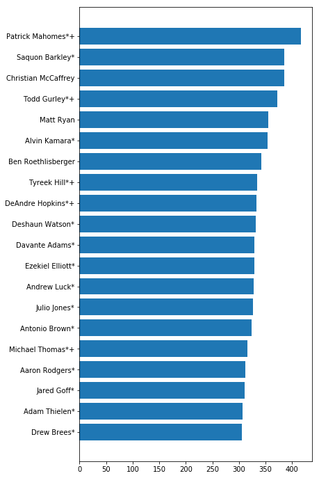

Nerd Stuff


```python
import pandas as pd
import matplotlib.pyplot as plt

from src.general_parser import scrape_website, parse_data_table

%matplotlib inline
```

Fetch data from PFR and parse into a usable dataframe


```python
fantasy = 'https://www.pro-football-reference.com/years/2018/fantasy.htm'
```


```python
fantasy_players = parse_data_table(scrape_website(fantasy))
```

Convert string data to numeric for analysis


```python
fantasy_players['fantasy_points_ppr'] = pd.to_numeric(fantasy_players['fantasy_points_ppr'])
```

###### Okay, nerd stuff is done

# DeNumbers with Denoux

AAAAAAAAAAAAAAAAAAAAAAAAAAAAAAAAAAAAANd we back baby! Ready for another exciting (read hair-pulling) year of fantasy football where only the most skill (read luckiest) of the bunch will come out on top and claim victory over the rest.

This year I plan on having more comprehensive reports for each and every week so that we don't just dog on Andy Dalton when he inevitably lets us all down by being completely mediocre. My money is on Carson Wentz to become the next Andy Dalton. Alternatively, La'veon Bell is back in action and ready to put up huge fantsay numbers after all but nuking Bradley's chances of ever being competetive last year.

Let's get started by looking at which players put up the most fantasy points overall during the 2018 season.


```python
fantasy_players.sort_values(by='fantasy_points_ppr', ascending=False, inplace=True)
top_players = fantasy_players[:20].sort_values(by='fantasy_points_ppr')

plt.figure(figsize=(6, 12))
plt.barh(top_players['player'], top_players['fantasy_points_ppr'])
```


    <BarContainer object of 20 artists>





No surprise that the league MVP brought home the most fantasy points using Kansas City's explosive offensive punch (even if it did come at the cost of Drew Bree's best shot at MVP). Saquon Barkley and Christian McCaffrey managed to scoop up the next two spots even though their teams suck hot ass. This just goes to show that even piles of shit can have a gleaming golden piece of corn glimmer through. Wait...

### HOW DID FUCKBOI JARED GOFF GET MORE POINTS THAN DREW BREES!!!!

Sometimes the universe is just cruel, and then Rodger Goodell has to come and piss on your shoes and call it rain right to your face.
